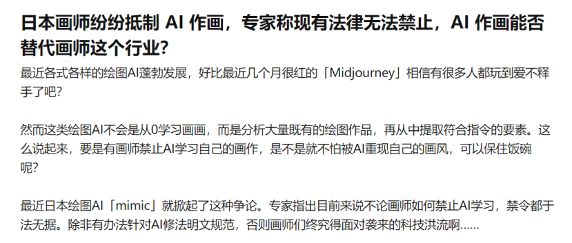
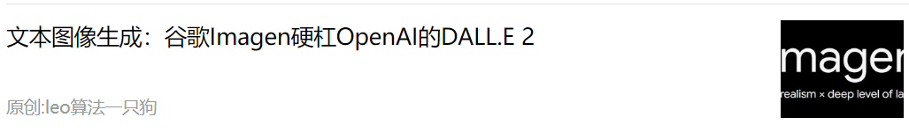
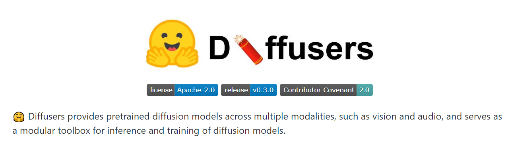
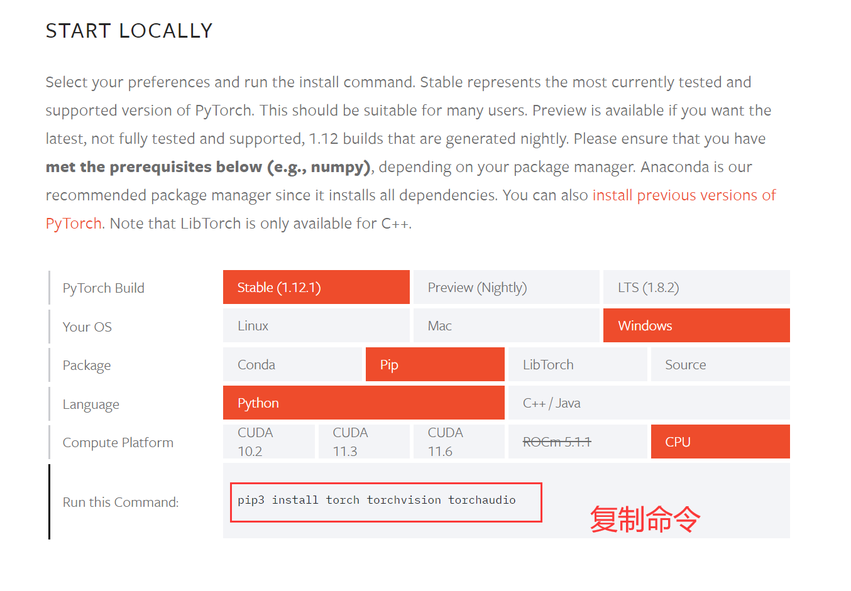
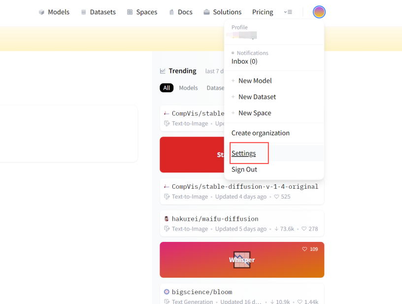
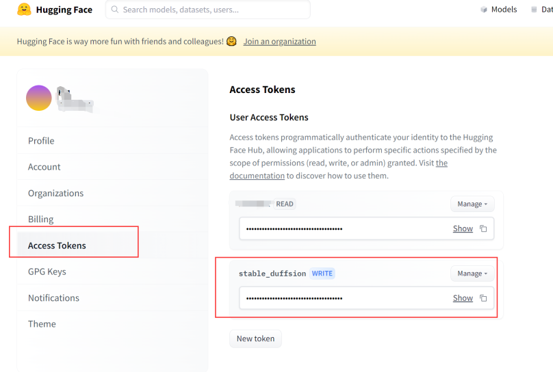
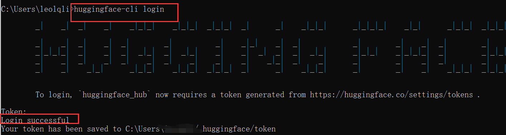
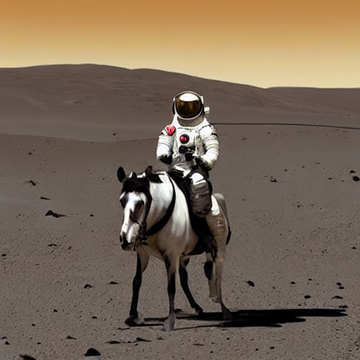
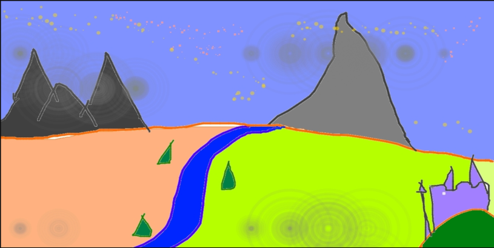
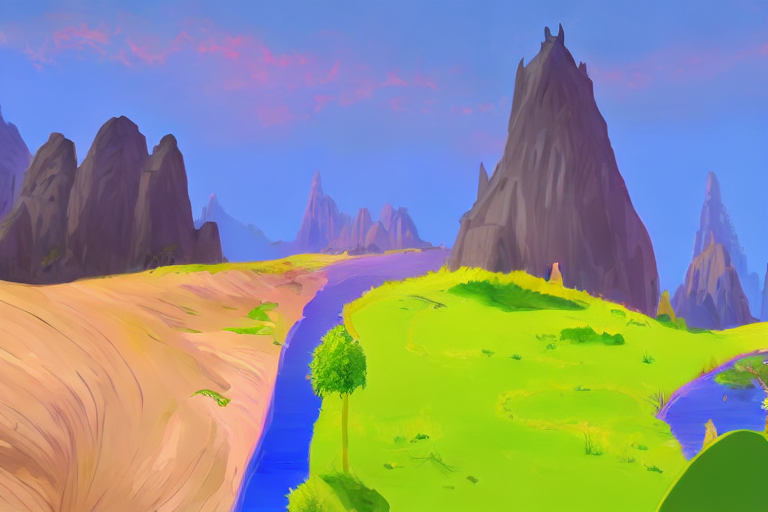

# 1.前言
最近文本生成图像AI太过于火爆，导致频频上热搜。
> **游戏设计师利用AI工具作画拿到一等奖：说的是美国的一位画师利用AI工具进行作画，并拿到了一等奖，从而惹来了大量的争议**


> **由于AI图像生成软件Midjorunery的爆火，导致大量的日本画师纷纷进行抵制**



而且我之前也写过很多类似的文本生成图像模型，像Imagen和Dall.E2，都是我之前介绍过的作品：

[https://mp.weixin.qq.com/s/8WmlqQ3QYzCPsZN1XZR-tw](https://mp.weixin.qq.com/s/8WmlqQ3QYzCPsZN1XZR-tw)



那作为一个成功的“调包侠”，当然是要寻找有没有现成的工具包，可以让我们直接在本地电脑进行图像生成。这恰好Huggingface推出了这个扩散模型包“Diffusers”。



# 2.Diffusers
这个包有以下具体功能：

- 只需要几行代码，就能够利用扩散diffusion模型生成图像，简直是广大手残党的福音
- 可以使用不同的“噪声调节器”，来平衡模型生成速度和质量之间的关系
- 更有多种不同类型的模型，能够端到端的构建diffusion模型

要利用文本生成图片，主要有以下几个步骤：

- 安装对应的功能包
- 登陆huggingface网站，获取token
- 输入代码，下载模型，等待生成结构

## 1.1 功能包安装 + 获取Token
除了需要安装"Diffusers"之外：
```shell
pip install --upgrade diffusers
```

还需要安装“pytorch”，“transformers ”等
```shell
pip install transformers
```

其中pytorch安装方法，可以去官网根据自己的环境进行获取：
[https://pytorch.org/get-started/locally/](https://pytorch.org/get-started/locally/)



除了安装python包之外，还需要去huggingface获取对应的token。

- 登陆官网，注册相应的账号，进行**settings**



- 新增自己token：



- 在自己的命令行上，输入“huggingface-cli login”，出现successful说明成功



## 1.2文本生成图像
这里直接调用最近很火的文本图像生成模型“Stable Diffusion”
```python
# make sure you're logged in with `huggingface-cli login`
from torch import autocast
from diffusers import StableDiffusionPipeline

pipe = StableDiffusionPipeline.from_pretrained("CompVis/stable-diffusion-v1-4", use_auth_token=True)
pipe = pipe.to("cuda")

prompt = "a photo of an astronaut riding a horse on mars"
with autocast("cuda"):
    image = pipe(prompt).images[0]  
```

如果你想提前下载模型，然后进行加载，可以先执行下面命令：
```shell
git lfs install
git clone https://huggingface.co/CompVis/stable-diffusion-v1-4
```

然后重新执行代码：
```python
pipe = StableDiffusionPipeline.from_pretrained("./stable-diffusion-v1-4")
pipe = pipe.to("cuda")

prompt = "a photo of an astronaut riding a horse on mars"
with autocast("cuda"):
    image = pipe(prompt).images[0]  
```


## 1.3 指导图像生成
不仅仅可以从0开始生成一张图片，Diffusers可以利用现有的一张图片，加入自己的语言进行指导，然后重新生成一张图片。

比如原始图片：


加入语言进行指导，让它生成更加艺术性
> A fantasy landscape, trending on artstation

最后生成图片如下：


那这种可玩性就更高了，由此扩展，是不是给定一张有水印的图片，就可以生成无水印的呢？或者更进一步（自行脑补三千字），咳咳~。再说下去，可能就要被封了，哈哈哈。

本次教程就到这里拉，我是leo，欢迎关注我的公众号/知乎"算法一只狗"，我们下期再见~

